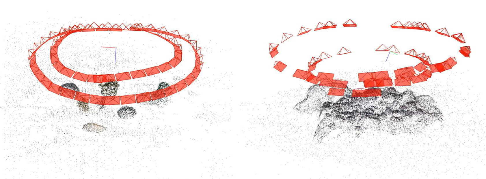

# Coral3D

This is the code repository accompanying our paper, "Cutting-edge 3D Reconstruction Solutions for Underwater Coral Reef Images: A Brief Review and Comparison."

# Code
## Simulate underwater imaging
To simulate the effects of underwater color shifts, suspended particles, and dispersion, we reduce the image brightness, enhance the blue and green channels, randomly add particles of varying sizes, and apply Gaussian filtering. The specific implementation can be found in [simulate_underwater_images.py](simulate_underwater_images.py). An example is shown in Figure 1.

Figure 1. Original image and simulated image in the underwater conditions.

# Dataset
The synthetic datasets used in this study were generated using [AirSim](https://github.com/microsoft/AirSim) platform, a simulator based on Unreal Engine that provides physically and visually realistic simulations.

Two synthetic datasets were created for this study: Coral-UE4 and Coral-UE5, based on Unreal Engine 4 and Unreal Engine 5, respectively. Both datasets contain images with a resolution of 2560×1440 pixels, captured from a 360-degree perspective around the scenes. The Coral-UE4 dataset features simpler, less textured scenes, while the Coral-UE5 dataset includes more complex, richly textured environments, as illustrated in Figure 2. To facilitate further analysis, both datasets were downsampled by uniformly selecting one-fourth of the images, resulting in simplified datasets: Coral-UE4 (lite) with 17 images and Coral-UE5 (lite) with 18 images.

Figure 2. Coral-UE4 and Coral-UE5 datasets.

Download links for the datasets:
* [Coral-UE4](https://drive.google.com/file/d/1FBbZXUq4enfML9EOXxe6IhuniwP0U6q2/view?usp=sharing)
* [Coral-UE4 (lite)](https://drive.google.com/file/d/1bnHmXT89QcTdyYjKAUBu7qRo7vHOePpE/view?usp=sharing)
* [Coral-UE5](https://drive.google.com/file/d/1f7DIWmr5QE-g3fTtcNqz0gY-8I9xxNwF/view?usp=sharing)
* [Coral-UE5 (lite)](https://drive.google.com/file/d/16lcv3kzJXkqbwiCOri82OhrPYhy-y4hB/view?usp=sharing)

The models and UE projects will be available after the paper is accepted.

# Code references for methods involved in the paper
## Feature extraction methods
| Method | Link |
| :-----| :---- |
| SIFT | Refer to https://github.com/opencv/opencv |
| KAZE | Refer to https://github.com/opencv/opencv |
| SuperPoint | https://github.com/magicleap/SuperPointPretrainedNetwork |
| R2D2 | https://github.com/naver/r2d2 |
| DISK | https://github.com/cvlab-epfl/disk |
| ALIKED | https://github.com/Shiaoming/ALIKED |
| DeDoDe | https://github.com/Parskatt/DeDoDe |
## Feature matching methods
| Method | Link |
| :-----| :---- |
| AdaLAM | https://github.com/cavalli1234/AdaLAM |
| SuperGlue | https://github.com/magicleap/SuperGluePretrainedNetwork |
| LightGlue | https://github.com/cvg/LightGlue |
| LoFTR | https://github.com/zju3dv/LoFTR |
## Dense reconstruction methods
| Method | Link |
| :-----| :---- |
| COLMAP | https://github.com/colmap/colmap |
| Vis-MVSNet | https://github.com/jzhangbs/Vis-MVSNet |
| MVSFormer++ | https://github.com/maybeLx/MVSFormerPlusPlus |
| Instant-NGP | https://github.com/NVlabs/instant-ngp |
| Nerfacto | https://github.com/nerfstudio-project/nerfstudio |
| Neuralangelo | https://github.com/NVlabs/neuralangelo |
| SuGaR | https://github.com/Anttwo/SuGaR |
| 2D Gaussian Splatting | https://github.com/hbb1/2d-gaussian-splatting |
| Gaussian Opacity Fields | https://github.com/autonomousvision/gaussian-opacity-fields |